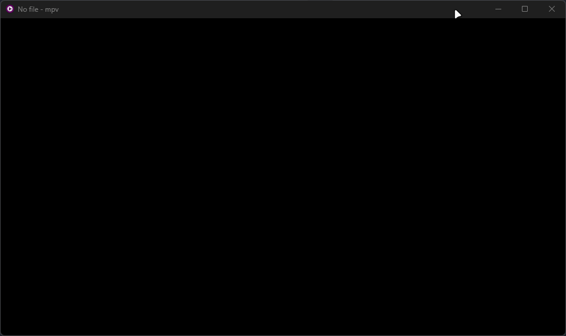

# mpv-torrserver-menu



A [uosc](https://github.com/tomasklaen/uosc) menu for [mpv](https://mpv.io) that searches, adds, browses, and streams torrents through a local [TorrServer](https://github.com/YouROK/TorrServer) instance — no browser, no separate torrent client.

> **uosc only.** This script builds its menu on top of uosc's menu API. It won't work with other mpv OSD/menu setups.

## Features

- Search torrents via JacRed (native API or Jackett-compatible)
- Filter results by size, seeds, quality, video type, content type, year, language, dub
- Add magnet links (clipboard paste or search result) or `.torrent` files
- History of previously played torrents, resumable from the root menu
- Manages the local TorrServer process: starts it on demand, checks for updates and offers to install them via the menu
- Per-torrent file browser with playback progress

## Requirements

- [mpv](https://mpv.io) — tested on v0.41.0
- [uosc](https://github.com/tomasklaen/uosc) — tested on v5.13.0
- Windows (tested); Linux/macOS should work (TorrServer binaries are published for both) but are untested — reports welcome

## Installation

1. Download the files from this repository into your mpv config directory (`%APPDATA%\mpv\` on Windows, `~/.config/mpv/` on Linux/macOS). This project only adds the files marked below — everything else (uosc, other scripts, etc.) is your existing setup:

   ```
   mpv/                              ← your mpv config root
   ├── bin/
   │   └── TorrServer.exe            ← downloaded on first click of "Add torrent" / "Update TorrServer" in the menu, not automatic
   ├── cache/
   │   └── torrserver/               ← created automatically at runtime
   ├── modules/
   │   ├── native-dialog.lua         ← from this project
   │   ├── platform.lua              ← from this project
   │   └── utils.lua                 ← from this project
   ├── script-opts/
   │   └── torrserver.conf           ← from this project
   └── scripts/
       ├── torrserver/
       │   ├── main.lua               ← from this project (entry point)
       │   ├── search-api.lua         ← from this project (JacRed search API client)
       │   ├── torrserver-api.lua     ← from this project (TorrServer HTTP API + process management)
       │   └── torrserver-update.lua  ← from this project (TorrServer release/update management)
       └── uosc/                     ← required dependency, install separately
   ```

2. Restart mpv.

The TorrServer binary itself is **not bundled**. On first use (when the binary is missing) the menu offers to download it; later it shows an update option with the current and new versions (into `~~/bin/`).

## Usage

Add a keybinding in your `input.conf` (this also puts the item into the uosc menu):

```
t script-binding torrserver  #! Torrent
```

You can use any free key instead of `t` (for example `Ctrl+t`, `Alt+t`, etc.). The `#! Torrent` comment is what makes the entry appear in the uosc menu.

Open the menu, paste or search for a magnet, pick a file, and it streams straight into mpv.

## Configuration

All options live in `script-opts/torrserver.conf`. Key ones:

```ini
torr_server=http://localhost:8090
search_server=https://jac.red,https://jacred.stream
search_api=native
history_limit=20
size_filters=0-10,10-20,20-30,30-50,50-100,100-
```

See the file for the full list (search timeouts/retries, metadata polling, update-check interval, etc).

## Updating

When the TorrServer binary is missing, the menu offers to download it. When a newer version is available, the menu shows an "Update TorrServer" entry with the current and target versions; choosing it downloads and swaps the binary. For script updates, pull the latest changes from this repository and re-copy the files above.

## Support

If this saved you some effort, you can [support via PayPal](https://www.paypal.com/paypalme/BlendFan).
